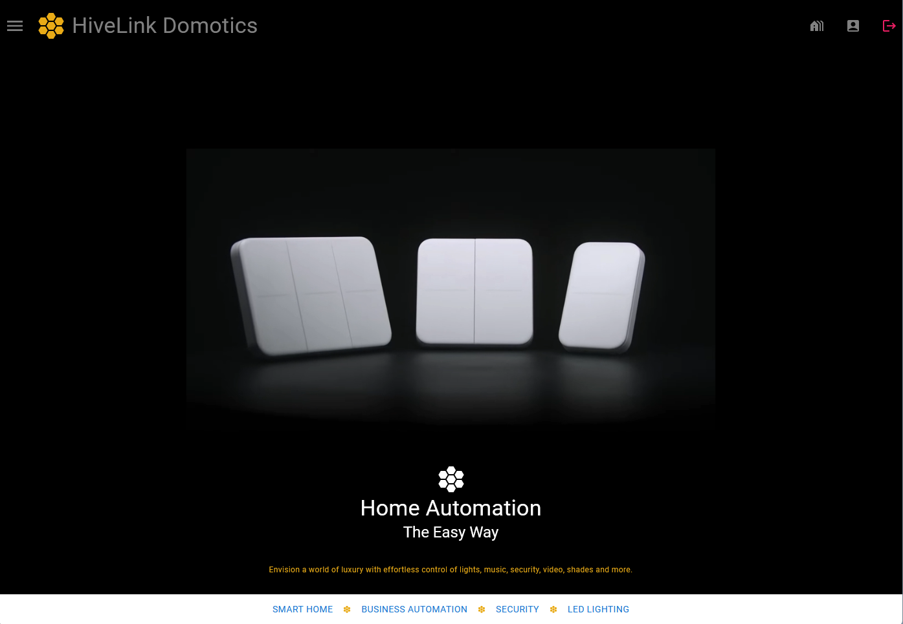

# HiveLink Home Automation Platform

HiveLink is an all-in-one platform for seamless smart home experiences. With HiveLink, you can effortlessly purchase, manage, and schedule installation services for a wide range of smart home devices.

## Archetecture

The platform is implemented as a full MERN stack monorepo with containerized packages for each service. The services are as follows:

- [HiveLink]()
    - [HiveLink-Web]() Client facing web interface with token based authentication. Built with React JS. 
    - [HiveLink-Server]() API server for managing user accounts and authentication. Built with Node JS and the Express framework.
    - [HiveLink-Common]() Shared code between the web and server packages. Contains Prisma ORM model typings, input validation schemas, and other utility functions.
    - [HiveLink-Broker]()  MQTT Message broker for routing messages between devices. Built with Node JS using the <a href="https://github.com/moscajs/aedes#aedes">Aedes(mosca)</a> framework, and utilizes redis for message persistence.
    - [HiveLink-Database]() MySQL database for storing user account information and device  configurations. Built with MySQL and the Prisma ORM.
 
